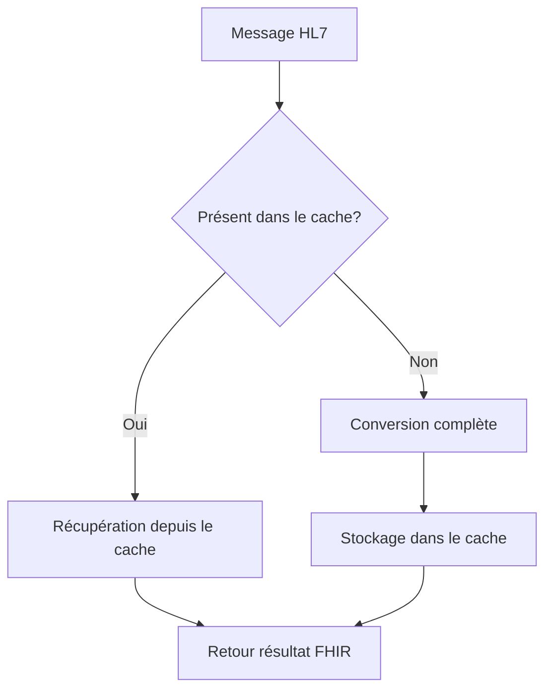

# Système de Cache Intelligent pour FHIRHub

FHIRHub intègre un système de cache intelligent qui optimise considérablement les performances de conversion des messages HL7 vers FHIR, particulièrement pour les messages identiques ou similaires répétés.

## Architecture du Système de Cache



## Caractéristiques Principales

### 1. Cache à Deux Niveaux
- **Cache en mémoire**: Pour des accès ultra-rapides aux messages récemment convertis
- **Cache sur disque**: Pour la persistance des données entre les redémarrages du serveur

### 2. Stratégies d'Éviction Intelligentes
- **LRU (Least Recently Used)**: Supprime les entrées les moins récemment utilisées lorsque le cache atteint sa capacité maximale
- **LFU (Least Frequently Used)**: Option configurable pour supprimer les entrées les moins fréquemment utilisées (idéal pour les charges de travail avec motifs récurrents)

### 3. Gestion Optimisée des Ressources
- Taille maximale configurable (par défaut: 500 entrées en mémoire, 5000 sur disque)
- Nettoyage automatique des entrées expirées
- Configuration du Time-To-Live (TTL) pour contrôler la durée de validité des entrées

### 4. Métriques et Statistiques
- Taux de succès du cache (hit ratio)
- Temps d'exécution comparatifs (avec/sans cache)
- Utilisation mémoire et disque

## Bénéfices du Cache Intelligent

| Aspect | Sans Cache | Avec Cache | Amélioration |
|--------|------------|------------|--------------|
| Temps de conversion moyen | 10-50ms | <1ms (pour les hits) | >95% |
| Utilisation CPU | Élevée | Réduite | >60% |
| Charge serveur | Élevée | Équilibrée | Variable |
| Expérience utilisateur | Bonne | Excellente | Perceptible |

## API de Gestion du Cache

### Endpoints Disponibles

- **GET /api/cache/stats**: Récupère les statistiques détaillées du cache
  - Taux de hit/miss
  - Utilisation mémoire et disque
  - Configuration actuelle

- **POST /api/cache/clear**: Vide le cache (mémoire et disque)
  - Nécessite une authentification
  - Utile lors de mises à jour majeures

### Exemple de Réponse Statistiques

```json
{
  "success": true,
  "data": {
    "memory": {
      "entries": 42,
      "maxSize": 500,
      "usage": 0.084
    },
    "disk": {
      "entries": 156,
      "maxEntries": 5000,
      "size": 2456782,
      "sizeFormatted": "2.34 MB",
      "usage": 0.0312
    },
    "performance": {
      "hitPercentage": "87.25%",
      "hits": 345,
      "misses": 50,
      "total": 395
    },
    "config": {
      "ttl": 86400,
      "strategy": "lru",
      "diskCacheEnabled": true
    }
  }
}
```

## Configuration

Le système de cache est configurable à travers le fichier `src/cache/conversionCache.js`:

```javascript
// Configuration du cache
const CONFIG = {
  // Taille maximale du cache en mémoire (nombre d'entrées)
  MAX_MEMORY_CACHE_SIZE: 500,
  // Durée de vie des entrées du cache (en secondes)
  TTL: 86400, // 24 heures par défaut
  // Répertoire pour le cache persistant
  DISK_CACHE_DIR: './data/cache',
  // Taille maximale du cache disque (en nombre de fichiers)
  MAX_DISK_CACHE_SIZE: 5000,
  // Stratégie d'éviction : 'lru' ou 'lfu'
  EVICTION_STRATEGY: 'lru',
  // Active le cache persistant sur disque
  ENABLE_DISK_CACHE: true,
  // Seuil de similarité pour détecter des messages similaires
  SIMILARITY_THRESHOLD: 0.9,
  // Taille minimale pour être mis en cache
  MIN_MESSAGE_SIZE: 100
};
```

## Indicateurs de Performance

Les résultats de conversion via l'API incluent automatiquement des métadonnées indiquant si la réponse provient du cache et le temps de conversion:

```json
{
  "success": true,
  "data": {
    "resourceType": "Bundle",
    "id": "bundle-123456789",
    "type": "transaction",
    "entry": [...]
  },
  "meta": {
    "conversionTime": 0,
    "resourceCount": 5,
    "fromCache": true
  }
}
```

## Cas d'Utilisation Idéaux

1. **Environnements à forte charge**: Systèmes traitant un grand volume de messages HL7
2. **Messages répétitifs**: Systèmes où les mêmes messages sont souvent envoyés
3. **Interfaces de test**: Permet des tests rapides et répétitifs
4. **Applications critiques**: Situations où la latence doit être minimisée