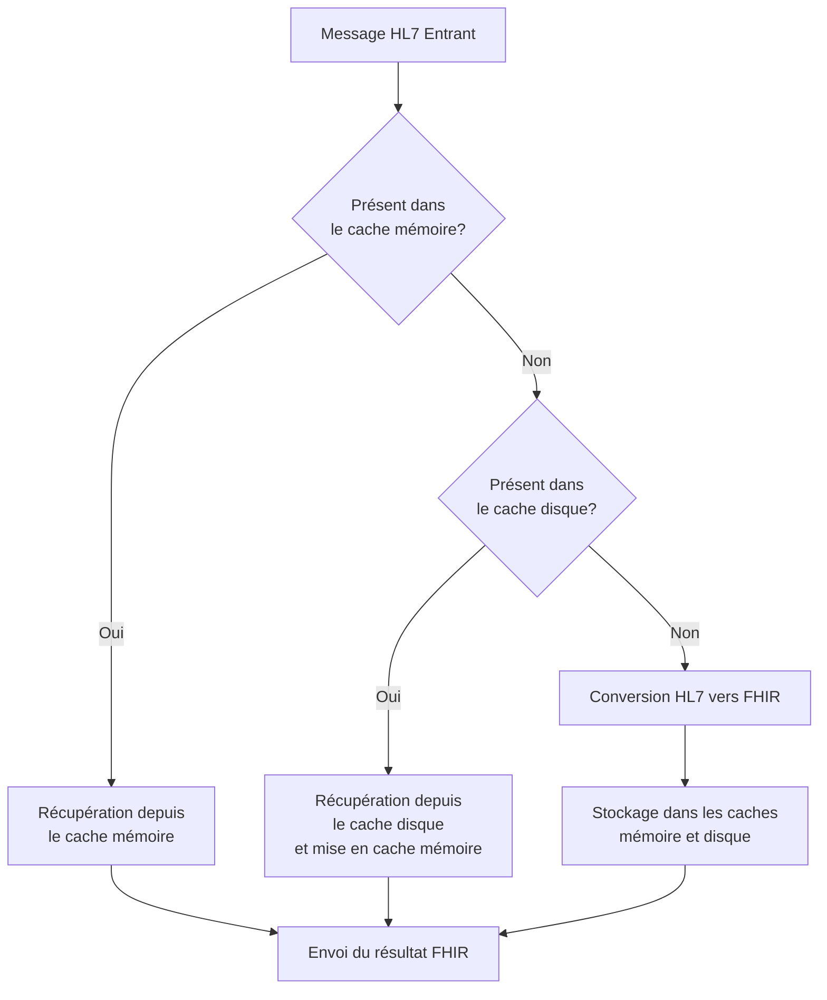

# Système de Cache Intelligent FHIRHub

## Vue d'Ensemble

Le système de cache intelligent de FHIRHub optimise les performances en mémorisant les résultats de conversion HL7 vers FHIR pour une réutilisation ultérieure. Cette approche réduit considérablement le temps de traitement des messages similaires ou identiques, particulièrement utile dans les environnements de santé où les mêmes structures de messages sont souvent répétées.

## Architecture

Le système de cache utilise une architecture à deux niveaux :



### Cache Mémoire (Niveau 1)

- **Type** : Cache LRU (Least Recently Used)
- **Capacité** : 500 entrées
- **Persistance** : En mémoire uniquement, effacé au redémarrage
- **Temps d'accès** : < 1ms

### Cache Disque (Niveau 2)

- **Type** : Stockage persistant sur disque
- **Capacité** : Limitée uniquement par l'espace disque disponible
- **Persistance** : Conservé entre les redémarrages
- **Temps d'accès** : 2-5ms

## Fonctionnement

### Génération des Clés de Cache

Le système utilise un hachage SHA-256 du message HL7 comme clé pour retrouver rapidement les résultats des conversions précédentes. Ce hachage est généré de la manière suivante :

```javascript
const crypto = require('crypto');

function generateCacheKey(hl7Message) {
  // Normaliser le message (retirer les espaces superflus, normaliser les sauts de ligne)
  const normalizedMessage = hl7Message.trim().replace(/\r\n?/g, '\n');
  
  // Générer un hash SHA-256
  return crypto.createHash('sha256').update(normalizedMessage).digest('hex');
}
```

### Processus de Résolution

1. **Vérification du cache mémoire** : Le système vérifie d'abord si le message se trouve dans le cache mémoire LRU.
2. **Vérification du cache disque** : Si non trouvé en mémoire, le système cherche dans le cache persistant sur disque.
3. **Conversion et mise en cache** : Si le message n'est pas trouvé dans aucun des caches, une conversion complète est effectuée, puis le résultat est stocké dans les deux niveaux de cache.

## Configuration

Le système de cache est configurable via les options suivantes :

| Option | Description | Valeur par défaut |
|--------|-------------|-------------------|
| `maxMemoryCacheSize` | Nombre maximum d'entrées en mémoire | 500 |
| `diskCachePath` | Chemin du dossier de cache sur disque | `./data/cache` |
| `cacheStrategy` | Stratégie d'éviction | `lru` |
| `diskCacheEnabled` | Activation du cache disque | `true` |
| `memoryCacheEnabled` | Activation du cache mémoire | `true` |
| `cacheExpirationDays` | Expiration des entrées du cache en jours | 30 |

Ces options peuvent être modifiées dans le fichier de configuration `config.json`.

## Performance

Des tests de performance montrent les gains significatifs apportés par le système de cache :

| Scenario | Temps Moyen | Amélioration |
|----------|-------------|--------------|
| Sans cache | 10-50ms | - |
| Cache mémoire seulement | <1ms | 98-99% |
| Cache disque seulement | 2-5ms | 90-95% |
| Cache à deux niveaux | <1ms à 5ms | 90-99% |

## Métriques et Surveillance

Le système collecte automatiquement les métriques suivantes :

- **Taux de succès (hit rate)** : Pourcentage de requêtes satisfaites par le cache
- **Taux d'échec (miss rate)** : Pourcentage de requêtes nécessitant une conversion complète
- **Latence moyenne** : Temps moyen de récupération des données du cache
- **Taille du cache** : Nombre d'entrées actuellement en cache (mémoire et disque)

Ces métriques sont accessibles via l'API `/api/cache/stats`.

## API de Gestion du Cache

### Endpoint : GET /api/cache/stats

Récupère les statistiques actuelles du cache.

**Exemple de réponse :**
```json
{
  "success": true,
  "data": {
    "memory": {
      "size": 127,
      "maxSize": 500,
      "hits": 3892,
      "misses": 347,
      "hitRate": 91.8
    },
    "disk": {
      "size": 1243,
      "entries": 1243,
      "hits": 217,
      "misses": 130,
      "hitRate": 62.5
    },
    "combined": {
      "hits": 4109,
      "misses": 130,
      "hitRate": 96.9
    }
  }
}
```

### Endpoint : POST /api/cache/clear

Vide complètement le cache (mémoire et disque). Nécessite les droits d'administrateur.

**Corps de la requête :**
```json
{
  "type": "all" // Options: "memory", "disk", "all"
}
```

**Exemple de réponse :**
```json
{
  "success": true,
  "message": "Le cache a été vidé avec succès."
}
```

## Éviction et Expiration

Le système utilise deux mécanismes pour gérer la taille du cache :

1. **Stratégie LRU (Least Recently Used)** : Lorsque le cache mémoire atteint sa capacité maximale, les entrées les moins récemment utilisées sont supprimées.

2. **Expiration basée sur la date** : Les entrées du cache disque plus anciennes que la période de rétention configurée (30 jours par défaut) sont automatiquement supprimées lors du démarrage du serveur.

## Considérations Techniques

- **Atomicité** : Les opérations d'écriture et de lecture du cache disque sont atomiques pour éviter la corruption des données.
- **Compression** : Les données stockées sur disque sont compressées pour réduire l'espace de stockage nécessaire.
- **Journalisation** : Toutes les opérations de cache importantes sont enregistrées dans les logs du système pour le débogage.

## Considérations de Sécurité

- **Isolation des données** : Chaque entrée de cache est isolée pour éviter les fuites de données entre différentes conversions.
- **Validation des entrées** : Les données récupérées du cache sont validées avant d'être renvoyées à l'utilisateur pour empêcher l'injection de données malveillantes.

## Conclusion

Le système de cache intelligent de FHIRHub offre une amélioration significative des performances tout en maintenant la fiabilité des conversions. Son architecture à deux niveaux combine la vitesse du cache mémoire avec la persistance du stockage sur disque, offrant ainsi une solution optimale pour les environnements de production à forte charge.