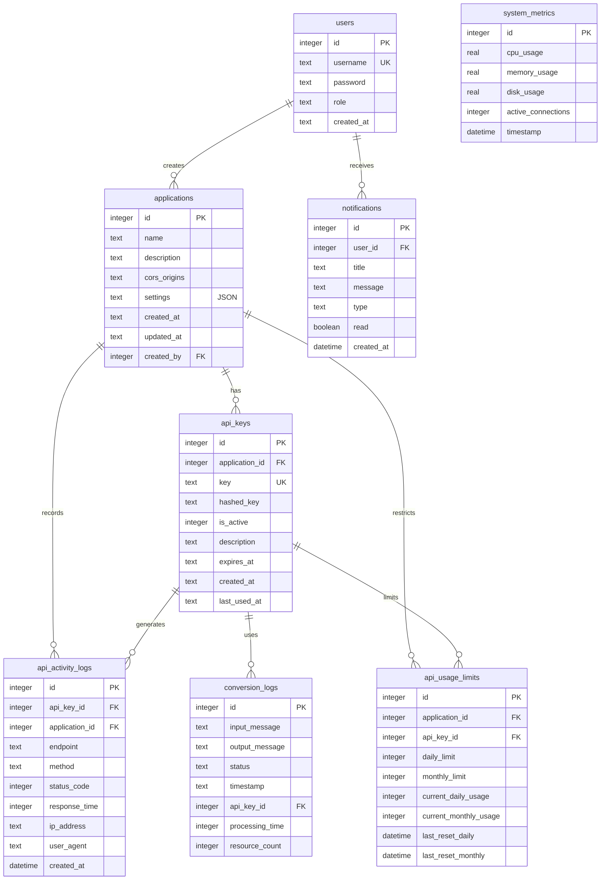

# Schéma de la Base de Données FHIRHub

## Diagramme Entité-Relation

## Description des tables

### users
Stocke les informations des utilisateurs du système.
- `id`: Identifiant unique
- `username`: Nom d'utilisateur (unique)
- `password`: Mot de passe haché
- `role`: Rôle (admin, user)
- `created_at`: Date de création

### applications
Stocke les applications enregistrées pouvant utiliser l'API.
- `id`: Identifiant unique
- `name`: Nom de l'application
- `description`: Description de l'application
- `cors_origins`: Origines CORS autorisées
- `settings`: Paramètres au format JSON
- `created_at`: Date de création
- `updated_at`: Date de mise à jour
- `created_by`: ID de l'utilisateur créateur

### api_keys
Stocke les clés API associées aux applications.
- `id`: Identifiant unique
- `application_id`: Référence à l'application
- `key`: Clé API (unique)
- `hashed_key`: Clé API hachée pour vérification
- `is_active`: État d'activation (1=actif, 0=inactif)
- `description`: Description de la clé
- `expires_at`: Date d'expiration
- `created_at`: Date de création
- `last_used_at`: Dernière utilisation

### conversion_logs
Enregistre les conversions HL7 vers FHIR effectuées.
- `id`: Identifiant unique
- `input_message`: Message HL7 d'entrée
- `output_message`: Message FHIR de sortie
- `status`: Statut de la conversion
- `timestamp`: Date et heure de la conversion
- `api_key_id`: Référence à la clé API utilisée
- `processing_time`: Temps de traitement en ms
- `resource_count`: Nombre de ressources générées

### system_metrics
Stocke les métriques système pour le monitoring.
- `id`: Identifiant unique
- `cpu_usage`: Utilisation CPU
- `memory_usage`: Utilisation mémoire
- `disk_usage`: Utilisation disque
- `active_connections`: Connexions actives
- `timestamp`: Date et heure de la mesure

### notifications
Gère les notifications envoyées aux utilisateurs.
- `id`: Identifiant unique
- `user_id`: Référence à l'utilisateur destinataire
- `title`: Titre de la notification
- `message`: Contenu de la notification
- `type`: Type (info, warning, error)
- `read`: État de lecture
- `created_at`: Date de création

### api_activity_logs
Enregistre l'activité des API pour l'audit.
- `id`: Identifiant unique
- `api_key_id`: Référence à la clé API
- `application_id`: Référence à l'application
- `endpoint`: Point de terminaison appelé
- `method`: Méthode HTTP
- `status_code`: Code de statut HTTP
- `response_time`: Temps de réponse
- `ip_address`: Adresse IP appelante
- `user_agent`: Agent utilisateur
- `created_at`: Date et heure de l'appel

### api_usage_limits
Gère les limites d'utilisation des API.
- `id`: Identifiant unique
- `application_id`: Référence à l'application
- `api_key_id`: Référence à la clé API
- `daily_limit`: Limite quotidienne
- `monthly_limit`: Limite mensuelle
- `current_daily_usage`: Utilisation quotidienne actuelle
- `current_monthly_usage`: Utilisation mensuelle actuelle
- `last_reset_daily`: Dernière remise à zéro quotidienne
- `last_reset_monthly`: Dernière remise à zéro mensuelle

## Relations entre les tables

- Un **utilisateur** peut créer plusieurs **applications**
- Un **utilisateur** peut recevoir plusieurs **notifications**
- Une **application** peut avoir plusieurs **clés API**
- Une **application** peut être associée à plusieurs **logs d'activité API**
- Une **clé API** peut générer plusieurs **logs d'activité API**
- Une **clé API** peut être utilisée dans plusieurs **logs de conversion**
- Une **application** peut avoir plusieurs **limites d'utilisation API**
- Une **clé API** peut avoir plusieurs **limites d'utilisation API**

## Stockage et Performance

FHIRHub utilise SQLite pour sa simplicité et sa portabilité. La base de données est stockée dans le fichier `data/fhirhub.db` et ne nécessite pas d'installation ou de configuration de serveur de base de données externe.

### Optimisations

- **Indexation**: Les champs fréquemment utilisés en recherche sont indexés
- **Requêtes préparées**: Toutes les requêtes utilisent des requêtes préparées pour la sécurité et la performance
- **Nettoyage périodique**: Les logs anciens sont archivés ou supprimés pour maintenir des performances optimales