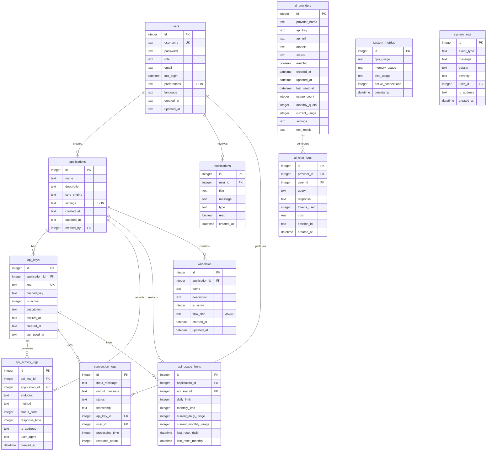

# Schéma de la Base de Données FHIRHub

## Implémentation technique SQLite

Le schéma de base de données FHIRHub est implémenté en SQLite pour garantir portabilité et performances. L'initialisation du schéma est réalisée dans le fichier `src/db/dbService.js` via des instructions SQL brutes exécutées séquentiellement lors du démarrage de l'application.

```javascript
function initializeDatabase(dbPath) {
  // Création/ouverture de la base de données
  const db = new sqlite3(dbPath);
  
  // Application de l'option PRAGMA pour les clés étrangères
  db.pragma('foreign_keys = ON');
  
  // Création des tables avec logging détaillé
  console.log('[DB] Initialisation de la structure...');
  
  // Table users
  const createUsers = `
  CREATE TABLE IF NOT EXISTS users (
    id INTEGER PRIMARY KEY AUTOINCREMENT,
    username TEXT NOT NULL UNIQUE,
    password TEXT NOT NULL,
    role TEXT NOT NULL DEFAULT 'user',
    email TEXT,
    last_login DATETIME,
    preferences TEXT,
    language TEXT DEFAULT 'fr',
    created_at DATETIME DEFAULT CURRENT_TIMESTAMP,
    updated_at DATETIME
  )`;
  console.log('[DB] Création de table: ' + createUsers);
  db.exec(createUsers);
  
  // Table applications
  // ... autres tables
}
```

## Diagramme entité-relation



## Implémentation des index

La base de données utilise des index stratégiques pour optimiser les requêtes fréquentes :

```sql
-- Index sur les conversions par utilisateur (pour les statistiques)
CREATE INDEX IF NOT EXISTS idx_conversion_logs_user_id ON conversion_logs(user_id);

-- Index sur les conversions par date (pour l'historique)
CREATE INDEX IF NOT EXISTS idx_conversion_logs_timestamp ON conversion_logs(timestamp);

-- Index sur les clés API pour authentification rapide
CREATE INDEX IF NOT EXISTS idx_api_keys_key ON api_keys(key);

-- Index sur les journaux d'API par application
CREATE INDEX IF NOT EXISTS idx_api_activity_logs_app_id ON api_activity_logs(application_id);

-- Index sur la recherche utilisateur
CREATE INDEX IF NOT EXISTS idx_users_username ON users(username);

-- Index sur les métriques système par date (pour graphiques)
CREATE INDEX IF NOT EXISTS idx_system_metrics_timestamp ON system_metrics(timestamp);
```

## Migrations de schéma

Les migrations de schéma sont gérées via le système `SchemaManager` qui applique les modifications incrémentales au démarrage :

```javascript
class SchemaManager {
  constructor(db) {
    this.db = db;
    this.migrations = [
      {
        version: '1.0.0',
        up: async (db) => {
          // Migrations initiales
        }
      },
      {
        version: '1.0.1',
        up: async (db) => {
          // Ajout de la colonne email à users
          await db.exec('ALTER TABLE users ADD COLUMN email TEXT');
        }
      },
      {
        version: '1.1.0',
        up: async (db) => {
          // Ajout de la colonne user_id à conversion_logs
          await db.exec('ALTER TABLE conversion_logs ADD COLUMN user_id INTEGER REFERENCES users(id) ON DELETE SET NULL');
          
          // Nouvel index pour la recherche utilisateur
          await db.exec('CREATE INDEX IF NOT EXISTS idx_conversion_logs_user_id ON conversion_logs(user_id)');
        }
      }
      // Autres migrations
    ];
  }
  
  async applyMigrations() {
    // Création de la table de migrations si elle n'existe pas
    this.db.exec(`
      CREATE TABLE IF NOT EXISTS schema_migrations (
        version TEXT PRIMARY KEY,
        applied_at DATETIME DEFAULT CURRENT_TIMESTAMP
      )
    `);
    
    // Récupération des migrations déjà appliquées
    const appliedMigrations = this.db.prepare('SELECT version FROM schema_migrations').all()
      .map(row => row.version);
    
    // Application des migrations manquantes
    for (const migration of this.migrations) {
      if (!appliedMigrations.includes(migration.version)) {
        console.log(`[DB] Application de la migration ${migration.version}`);
        
        try {
          // Début de transaction
          this.db.exec('BEGIN TRANSACTION');
          
          // Exécution de la migration
          await migration.up(this.db);
          
          // Enregistrement de la migration
          this.db.prepare('INSERT INTO schema_migrations (version) VALUES (?)').run(migration.version);
          
          // Commit de la transaction
          this.db.exec('COMMIT');
          console.log(`[DB] Migration ${migration.version} appliquée avec succès`);
        } catch (error) {
          // Rollback en cas d'erreur
          this.db.exec('ROLLBACK');
          console.error(`[DB] Erreur lors de la migration ${migration.version}:`, error);
          throw error;
        }
      }
    }
  }
}
```

## Optimisations techniques

1. **Transactions atomiques** : Toutes les opérations critiques sont exécutées dans des transactions pour éviter la corruption de données.

2. **Verrouillage optimisé** : Le mode WAL (Write-Ahead Logging) est activé pour permettre les lectures parallèles.

```javascript
// Activation du mode WAL pour de meilleures performances en concurrence
db.pragma('journal_mode = WAL');
```

3. **Requêtes préparées** : Toutes les requêtes sont préparées pour optimiser les performances et éviter les injections SQL.

```javascript
// Mauvaise pratique (risque d'injection SQL)
db.exec(`DELETE FROM users WHERE id = ${userId}`);

// Bonne pratique (requête préparée)
const stmt = db.prepare('DELETE FROM users WHERE id = ?');
stmt.run(userId);
```

4. **Nettoyage périodique** : Un job programmé nettoie les anciennes données pour maintenir les performances.

```javascript
// Nettoyage des logs plus anciens que 90 jours
const cleanupOldLogs = db.prepare(`
  DELETE FROM api_activity_logs 
  WHERE created_at < datetime('now', '-90 days')
`);

// Exécution périodique
setInterval(() => {
  try {
    const result = cleanupOldLogs.run();
    console.log(`[DB] Nettoyage des logs: ${result.changes} entrées supprimées`);
  } catch (error) {
    console.error('[DB] Erreur lors du nettoyage:', error);
  }
}, 24 * 60 * 60 * 1000); // Une fois par jour
```

## Procédures stockées courantes

Les requêtes complexes sont encapsulées dans des fonctions JavaScript pour une meilleure réutilisation :

```javascript
// Récupération des statistiques de conversion par utilisateur
function getUserConversionStats(userId) {
  return db.prepare(`
    SELECT 
      COUNT(*) as count,
      AVG(processing_time) as avg_time,
      MAX(processing_time) as max_time,
      MIN(processing_time) as min_time,
      AVG(resource_count) as avg_resources
    FROM conversion_logs
    WHERE user_id = ?
  `).get(userId);
}

// Récupération des conversions récentes avec pagination
function getRecentConversions(page = 1, pageSize = 10) {
  const offset = (page - 1) * pageSize;
  
  const conversions = db.prepare(`
    SELECT 
      c.*,
      u.username as user_name,
      a.name as application_name
    FROM conversion_logs c
    LEFT JOIN users u ON c.user_id = u.id
    LEFT JOIN api_keys k ON c.api_key_id = k.id
    LEFT JOIN applications a ON k.application_id = a.id
    ORDER BY c.timestamp DESC
    LIMIT ? OFFSET ?
  `).all(pageSize, offset);
  
  const total = db.prepare(`
    SELECT COUNT(*) as count FROM conversion_logs
  `).get().count;
  
  return {
    data: conversions,
    pagination: {
      page,
      pageSize,
      totalItems: total,
      totalPages: Math.ceil(total / pageSize)
    }
  };
}
```

## Sauvegardes et maintenance

Le système intègre des fonctions automatisées pour la sauvegarde et la maintenance de la base de données :

```javascript
// Fonction de sauvegarde de la base de données
async function backupDatabase(db, backupPath) {
  return new Promise((resolve, reject) => {
    const backupDir = path.dirname(backupPath);
    
    // Créer le répertoire de sauvegarde s'il n'existe pas
    if (!fs.existsSync(backupDir)) {
      fs.mkdirSync(backupDir, { recursive: true });
    }
    
    // Format de nom avec horodatage
    const timestamp = new Date().toISOString().replace(/[:.]/g, '-');
    const finalBackupPath = path.join(
      backupDir,
      `fhirhub-backup-${timestamp}.sqlite`
    );
    
    console.log(`[DB] Début de la sauvegarde vers ${finalBackupPath}`);
    
    try {
      // Sauvegarde atomique via l'API de backup de SQLite
      const backup = db.backup(finalBackupPath);
      
      backup.step(-1);  // Copier toute la base en une fois
      backup.finish();
      
      console.log(`[DB] Sauvegarde terminée: ${finalBackupPath}`);
      
      // Compression de la sauvegarde
      const gzip = zlib.createGzip();
      const source = fs.createReadStream(finalBackupPath);
      const destination = fs.createWriteStream(`${finalBackupPath}.gz`);
      
      source.pipe(gzip).pipe(destination);
      
      destination.on('finish', () => {
        // Suppression du fichier non compressé
        fs.unlinkSync(finalBackupPath);
        console.log(`[DB] Sauvegarde compressée: ${finalBackupPath}.gz`);
        resolve(`${finalBackupPath}.gz`);
      });
    } catch (error) {
      console.error(`[DB] Erreur de sauvegarde:`, error);
      reject(error);
    }
  });
}

// Fonction de vérification d'intégrité de la base de données
function checkDatabaseIntegrity(db) {
  console.log('[DB] Vérification de l\'intégrité...');
  
  const result = db.pragma('integrity_check');
  
  if (result === 'ok') {
    console.log('[DB] Intégrité vérifiée: OK');
    return true;
  } else {
    console.error('[DB] Problème d\'intégrité détecté:', result);
    return false;
  }
}

// Fonction d'optimisation de la base de données
function optimizeDatabase(db) {
  console.log('[DB] Début de l\'optimisation...');
  
  // Analyse des index pour optimiser le plan d'exécution
  db.exec('ANALYZE');
  
  // Défragmentation de la base
  db.exec('VACUUM');
  
  // Optimisation des index
  db.exec('REINDEX');
  
  console.log('[DB] Optimisation terminée');
}
```