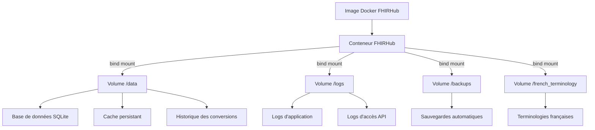

# Déploiement avec Docker

## Vue d'Ensemble

FHIRHub propose une solution de déploiement basée sur Docker qui facilite grandement l'installation, la maintenance et la mise à jour de l'application. Cette approche est particulièrement adaptée aux environnements de production.

## Architecture Docker

L'architecture Docker de FHIRHub utilise des volumes persistants pour garantir la pérennité des données entre les redémarrages et les mises à jour :



## Prérequis

- Docker Engine 20.10 ou supérieur
- Docker Compose 2.0 ou supérieur
- 2 Go de RAM minimum (4 Go recommandés)
- 1 Go d'espace disque minimum

## Méthodes de Déploiement

### Méthode Rapide (Recommandée)

Cette méthode utilise le script d'initialisation fourni pour configurer automatiquement l'environnement :

1. **Exécuter le script d'initialisation** :

```bash
./docker-init.sh
```

2. **Démarrer l'application** :

```bash
docker-compose -f docker-compose.prod.yml up -d
```

3. **Accéder à l'application** : 
   - URL : `http://localhost:5000`
   - Identifiants par défaut : `admin` / `adminfhirhub`

### Méthode Manuelle

Pour les utilisateurs qui préfèrent configurer manuellement ou qui ont besoin de personnaliser l'installation :

1. **Créer la structure de dossiers pour les volumes** :

```bash
mkdir -p volumes/data volumes/logs volumes/backups volumes/french_terminology
mkdir -p volumes/data/conversions volumes/data/history volumes/data/outputs volumes/data/test
```

2. **Créer le fichier `.env`** :

```ini
PORT=5000
JWT_SECRET=fhirhub-secure-jwt-secret-change-me
DATA_DIR=./volumes/data
LOGS_DIR=./volumes/logs
BACKUPS_DIR=./volumes/backups
TERMINOLOGY_DIR=./volumes/french_terminology
```

3. **Démarrer l'application** :

```bash
docker-compose -f docker-compose.prod.yml up -d
```

## Gestion du Conteneur

### Commandes Courantes

| Opération | Commande |
|-----------|----------|
| Démarrer  | `docker-compose -f docker-compose.prod.yml up -d` |
| Arrêter   | `docker-compose -f docker-compose.prod.yml down` |
| Redémarrer| `docker-compose -f docker-compose.prod.yml restart` |
| Logs      | `docker-compose -f docker-compose.prod.yml logs -f` |
| Mise à jour | `docker-compose -f docker-compose.prod.yml up -d --build` |

### Configuration des Ports

Par défaut, FHIRHub utilise le port 5000. Pour modifier le port, éditez le fichier `.env` :

```ini
PORT=8080  # Remplacez 5000 par le port souhaité
```

Puis redémarrez le conteneur :

```bash
docker-compose -f docker-compose.prod.yml down
docker-compose -f docker-compose.prod.yml up -d
```

## Persistance des Données

### Structure des Volumes

Les données de FHIRHub sont stockées dans quatre volumes principaux :

1. **data** : Contient la base de données SQLite, le cache persistant et l'historique des conversions
2. **logs** : Stocke les fichiers journaux de l'application et les logs d'accès API
3. **backups** : Conserve les sauvegardes automatiques et manuelles
4. **french_terminology** : Maintient les fichiers de terminologie française

### Sauvegarde et Restauration

#### Créer une Sauvegarde Manuelle

```bash
# Arrêter d'abord le conteneur
docker-compose -f docker-compose.prod.yml down

# Créer une archive de sauvegarde
tar -czf fhirhub_backup_$(date +%Y%m%d).tar.gz volumes/

# Redémarrer le conteneur
docker-compose -f docker-compose.prod.yml up -d
```

#### Restaurer une Sauvegarde

```bash
# Arrêter d'abord le conteneur
docker-compose -f docker-compose.prod.yml down

# Extraire l'archive de sauvegarde
tar -xzf fhirhub_backup_YYYYMMDD.tar.gz

# Redémarrer le conteneur
docker-compose -f docker-compose.prod.yml up -d
```

## Sécurité

### Bonnes Pratiques

1. **Modifier le Secret JWT** dans le fichier `.env` :
   ```ini
   JWT_SECRET=votre-secret-très-sécurisé-et-unique
   ```

2. **Changer le mot de passe administrateur** après la première connexion

3. **Limiter l'accès au port** en utilisant un pare-feu ou en plaçant FHIRHub derrière un reverse proxy

4. **Activer HTTPS** en configurant un reverse proxy (comme Nginx ou Traefik)

### Configuration avec Reverse Proxy (HTTPS)

Exemple de configuration avec Nginx :

```nginx
server {
    listen 443 ssl;
    server_name fhirhub.example.com;

    # Certificats SSL
    ssl_certificate /etc/letsencrypt/live/fhirhub.example.com/fullchain.pem;
    ssl_certificate_key /etc/letsencrypt/live/fhirhub.example.com/privkey.pem;

    location / {
        proxy_pass http://localhost:5000;
        proxy_set_header Host $host;
        proxy_set_header X-Real-IP $remote_addr;
        proxy_set_header X-Forwarded-For $proxy_add_x_forwarded_for;
        proxy_set_header X-Forwarded-Proto $scheme;
    }
}
```

## Mises à Jour

### Procédure de Mise à Jour

1. **Récupérer les modifications** :
   ```bash
   git pull  # Si vous utilisez Git
   # ou télécharger la nouvelle version
   ```

2. **Reconstruire et redémarrer le conteneur** :
   ```bash
   docker-compose -f docker-compose.prod.yml up -d --build
   ```

Les données existantes seront préservées grâce aux volumes persistants.

## Dépannage

### Problèmes Courants et Solutions

| Problème | Solution |
|----------|----------|
| Le conteneur ne démarre pas | Vérifier les logs : `docker-compose -f docker-compose.prod.yml logs` |
| Problèmes de permissions | Corriger les permissions : `chmod -R 755 volumes/` |
| Port déjà utilisé | Modifier le port dans le fichier `.env` |
| Base de données corrompue | Restaurer à partir d'une sauvegarde |

### Vérification de l'État

```bash
# Vérifier si le conteneur est en cours d'exécution
docker ps | grep fhirhub

# Vérifier les ressources utilisées
docker stats fhirhub
```

## Environnements Spécifiques

### Déploiement en Production

Pour un environnement de production, utilisez toujours `docker-compose.prod.yml` qui inclut des optimisations de performances et de sécurité.

### Déploiement de Développement

Pour le développement, vous pouvez utiliser le fichier standard :

```bash
docker-compose up -d
```

Ce mode monte le code source en volume pour permettre un développement en temps réel.