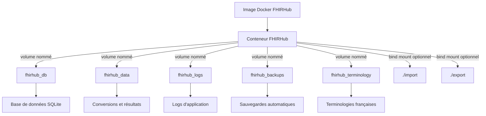

# Déploiement avec Docker

## Vue d'Ensemble

FHIRHub propose une solution de déploiement basée sur Docker qui facilite grandement l'installation, la maintenance et la mise à jour de l'application. Cette approche est particulièrement adaptée aux environnements de production.

## Architecture Docker Optimisée

L'architecture Docker de FHIRHub utilise des volumes nommés pour garantir la pérennité et l'isolation des données entre les redémarrages et les mises à jour :



## Prérequis

- Docker Engine 20.10 ou supérieur
- Docker Compose 2.0 ou supérieur
- 2 Go de RAM minimum (4 Go recommandés)
- 1 Go d'espace disque minimum

## Méthode de Déploiement

### Démarrage Standard

Le déploiement a été simplifié pour utiliser un seul fichier de configuration docker-compose.yml :

1. **Démarrer l'application** :

```bash
docker-compose up -d
```

2. **Accéder à l'application** : 
   - URL : `http://localhost:5001`
   - Identifiants par défaut : `admin` / `admin123`

## Gestion du Conteneur

### Commandes Courantes

| Opération | Commande |
|-----------|----------|
| Démarrer  | `docker-compose up -d` |
| Arrêter   | `docker-compose down` |
| Redémarrer| `docker-compose restart` |
| Logs      | `docker-compose logs -f` |
| Mise à jour | `docker-compose up -d --build` |

### Configuration des Ports

Par défaut, FHIRHub utilise le port 5001 (changement par rapport à la version précédente qui utilisait 5000). Pour modifier le port, éditez le fichier `docker-compose.yml` :

```yaml
services:
  fhirhub:
    # ...
    ports:
      - "8080:5001"  # Remplacez 5001 par le port externe souhaité
```

Puis redémarrez le conteneur :

```bash
docker-compose down
docker-compose up -d
```

## Persistance des Données

### Structure des Volumes

Les données de FHIRHub sont stockées dans quatre volumes principaux :

1. **data** : Contient la base de données SQLite, le cache persistant et l'historique des conversions
2. **logs** : Stocke les fichiers journaux de l'application et les logs d'accès API
3. **backups** : Conserve les sauvegardes automatiques et manuelles
4. **french_terminology** : Maintient les fichiers de terminologie française

### Sauvegarde et Restauration

#### Créer une Sauvegarde des Volumes Nommés

```bash
# Arrêter d'abord le conteneur
docker-compose down

# Sauvegarder les volumes nommés
docker run --rm -v fhirhub_db:/source -v $(pwd)/backups:/dest -w /source alpine tar czf /dest/fhirhub_db_backup_$(date +%Y%m%d).tar.gz .
docker run --rm -v fhirhub_data:/source -v $(pwd)/backups:/dest -w /source alpine tar czf /dest/fhirhub_data_backup_$(date +%Y%m%d).tar.gz .
docker run --rm -v fhirhub_terminology:/source -v $(pwd)/backups:/dest -w /source alpine tar czf /dest/fhirhub_terminology_backup_$(date +%Y%m%d).tar.gz .

# Redémarrer le conteneur
docker-compose up -d
```

Un script utilitaire `backup-docker-data.sh` est également fourni pour automatiser cette opération.

#### Restaurer une Sauvegarde

```bash
# Arrêter d'abord le conteneur
docker-compose down

# Restaurer les volumes nommés
docker run --rm -v fhirhub_db:/dest -v $(pwd)/backups:/source -w /dest alpine sh -c "rm -rf ./* && tar xzf /source/fhirhub_db_backup_YYYYMMDD.tar.gz"
docker run --rm -v fhirhub_data:/dest -v $(pwd)/backups:/source -w /dest alpine sh -c "rm -rf ./* && tar xzf /source/fhirhub_data_backup_YYYYMMDD.tar.gz"
docker run --rm -v fhirhub_terminology:/dest -v $(pwd)/backups:/source -w /dest alpine sh -c "rm -rf ./* && tar xzf /source/fhirhub_terminology_backup_YYYYMMDD.tar.gz"

# Redémarrer le conteneur
docker-compose up -d
```

## Réinitialisation des Données

Pour réinitialiser les données des volumes nommés, utilisez le script fourni :

```bash
./reset-docker-volumes.sh
```

Ce script détecte automatiquement les volumes nommés de FHIRHub et propose différentes options pour les réinitialiser. Il prend en charge l'option `-y` pour une exécution automatique dans des scripts de maintenance.

## Sécurité

### Bonnes Pratiques

1. **Modifier le Secret JWT** dans le fichier `docker-compose.yml` :
   ```yaml
   environment:
     - JWT_SECRET=votre-secret-très-sécurisé-et-unique
   ```

2. **Changer le mot de passe administrateur** après la première connexion (par défaut : `admin` / `admin123`)

3. **Limiter l'accès au port** en utilisant un pare-feu ou en plaçant FHIRHub derrière un reverse proxy

4. **Activer HTTPS** en configurant un reverse proxy (comme Nginx ou Traefik)

### Configuration avec Reverse Proxy (HTTPS)

Exemple de configuration avec Nginx :

```nginx
server {
    listen 443 ssl;
    server_name fhirhub.example.com;

    # Certificats SSL
    ssl_certificate /etc/letsencrypt/live/fhirhub.example.com/fullchain.pem;
    ssl_certificate_key /etc/letsencrypt/live/fhirhub.example.com/privkey.pem;

    location / {
        proxy_pass http://localhost:5001;  # Noter le changement de port à 5001
        proxy_set_header Host $host;
        proxy_set_header X-Real-IP $remote_addr;
        proxy_set_header X-Forwarded-For $proxy_add_x_forwarded_for;
        proxy_set_header X-Forwarded-Proto $scheme;
    }
}
```

## Mises à Jour

### Procédure de Mise à Jour

1. **Récupérer les modifications** :
   ```bash
   git pull  # Si vous utilisez Git
   # ou télécharger la nouvelle version
   ```

2. **Reconstruire et redémarrer le conteneur** :
   ```bash
   docker-compose up -d --build
   ```

Les données existantes seront préservées grâce aux volumes nommés persistants.

## Dépannage

### Problèmes Courants et Solutions

| Problème | Solution |
|----------|----------|
| Le conteneur ne démarre pas | Vérifier les logs : `docker-compose logs` |
| Problèmes de permissions | Vérifier les permissions des volumes : `docker volume inspect fhirhub_db` |
| Port déjà utilisé | Modifier le port dans le fichier `docker-compose.yml` |
| Base de données corrompue | Utiliser `reset-docker-volumes.sh` ou restaurer à partir d'une sauvegarde |
| Volumes manquants | Vérifier la liste des volumes : `docker volume ls | grep fhirhub` |

### Vérification de l'État

```bash
# Vérifier si le conteneur est en cours d'exécution
docker ps | grep fhirhub

# Vérifier les ressources utilisées
docker stats fhirhub

# Inspecter les volumes nommés
docker volume ls | grep fhirhub
```

## Environnements Spécifiques

FHIRHub peut être déployé dans différents environnements avec le même fichier de configuration `docker-compose.yml`. Les volumes nommés garantissent que les données sont isolées et préservées quels que soient les changements apportés au conteneur.