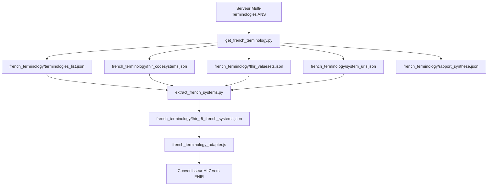

# Scripts de Gestion des Terminologies Françaises

## Vue d'Ensemble

FHIRHub intègre un système complet de gestion des terminologies françaises qui permet de maintenir à jour les mappings et codes utilisés lors de la conversion des messages HL7 vers FHIR. Cette documentation décrit les scripts Python utilisés pour récupérer et transformer ces terminologies.

## Architecture des Terminologies



## Scripts Python

### 1. get_french_terminology.py

Ce script principal récupère les terminologies françaises depuis le Serveur Multi-Terminologies (SMT) de l'Agence du Numérique en Santé (ANS).

#### Fonctionnalités

- Authentification auprès de l'API de l'ANS
- Téléchargement de la liste complète des terminologies
- Récupération des CodeSystems et ValueSets FHIR
- Extraction des URLs des systèmes de codage
- Génération d'un rapport de synthèse

#### Commande d'exécution

```bash
python get_french_terminology.py
```

#### Fichiers générés

- `french_terminology/terminologies_list.json` - Liste complète des terminologies
- `french_terminology/fhir_codesystems.json` - CodeSystems FHIR disponibles
- `french_terminology/fhir_valuesets.json` - ValueSets FHIR disponibles 
- `french_terminology/system_urls.json` - URLs des systèmes de codage
- `french_terminology/rapport_synthese.json` - Résumé des terminologies récupérées

### 2. extract_french_systems.py

Ce script traite les données brutes téléchargées pour en extraire les systèmes de terminologie français pertinents pour la conversion HL7 vers FHIR.

#### Fonctionnalités

- Identification des systèmes de terminologie importants pour la France
- Extraction d'exemples de codes pour chaque système
- Création de mappings recommandés pour les identifiants et rôles
- Génération d'un fichier JSON consolidé pour le convertisseur

#### Systèmes de terminologie supportés

Le script traite spécifiquement les terminologies françaises importantes :

- SNOMED CT
- LOINC
- CIM-10 et CIM-11 (classifications internationales des maladies)
- CCAM (Classification Commune des Actes Médicaux)
- NABM (Nomenclature des Actes de Biologie Médicale)
- ATC (Classification Anatomique, Thérapeutique et Chimique)
- CIP et UCD (codes médicaments)
- INS (Identifiant National de Santé)
- CPS (Carte de Professionnel de Santé)
- Et d'autres systèmes spécifiques français

#### Commande d'exécution

```bash
python extract_french_systems.py
```

#### Fichier généré

- `french_terminology/fhir_r5_french_systems.json` - Fichier consolidé pour le convertisseur

## Intégration avec le Convertisseur

Le fichier `french_terminology_adapter.js` utilise les mappings générés pour adapter les conversions aux spécificités françaises :

```javascript
/**
 * Récupère les informations sur un identifiant français
 * @param {string} idType - Type d'identifiant (INS, INS-C, etc.)
 * @returns {object} Objet contenant système, code et libellé
 */
function getIdentifierInfo(idType) {
  const mappings = require('./french_terminology/fhir_r5_french_systems.json');
  return mappings.recommended_mappings.identifier_types[idType] || null;
}
```

## Mise à Jour des Terminologies

Il est recommandé de mettre à jour les terminologies régulièrement (trimestriellement) pour rester conforme aux évolutions des standards français.

### Procédure de mise à jour

1. Exécuter le script de téléchargement :
   ```bash
   python get_french_terminology.py
   ```

2. Traiter les terminologies téléchargées :
   ```bash
   python extract_french_systems.py
   ```

3. Redémarrer l'application pour prendre en compte les nouvelles terminologies :
   ```bash
   # Installation standard
   bash start.sh
   
   # Installation Docker
   docker-compose -f docker-compose.prod.yml restart
   ```

## Dépannage

### Problèmes d'authentification API

Si l'authentification à l'API de l'ANS échoue :
- Vérifiez la disponibilité du serveur SMT : https://smt.esante.gouv.fr
- Le script continuera avec les endpoints publics même si l'authentification échoue

### Terminologies manquantes

Si certains systèmes spécifiques français manquent :
- Modifiez la liste `IMPORTANT_SYSTEMS` dans `extract_french_systems.py` pour ajouter les systèmes manquants
- Relancez le script de traitement

## Terminologies Françaises et Exigences ANS

L'Agence du Numérique en Santé (ANS) définit des spécifications françaises pour FHIR qui incluent :

1. **OIDs spécifiques pour les identifiants français**
   - INS-NIR : 1.2.250.1.213.1.4.8
   - INS-C : 1.2.250.1.213.1.4.11
   - RPPS : 1.2.250.1.71.4.2.1
   - FINESS : 1.2.250.1.71.4.2.2

2. **Terminologies spécifiques à la France**
   - CCAM pour les actes médicaux
   - SNOMED CT France
   - CIM-10 FR (version française de l'ICD-10)

3. **Extensions françaises pour FHIR**
   - encounter-expectedExitDate pour les dates de sorties prévues
   - ins-source pour qualifier la source de l'INS
   - Identifiants multiples avec qualification de source

FHIRHub intègre ces spécificités françaises pour garantir l'interopérabilité avec les systèmes de santé français.